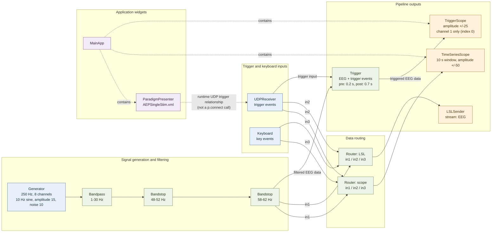

# Pipeline Schema

Solid arrows show the `p.connect(...)` signal paths. Both routers merge their three inputs: filtered EEG from `notch60`, UDP triggers, and keyboard events. The scope router feeds `TimeSeriesScope`; the LSL router feeds `LSLSender`. The trigger detector receives filtered EEG and UDP trigger events; its triggered EEG output feeds `TriggerScope`, which displays only channel index 0 (channel 1). The generator is configured for 250 Hz and 8 channels. Dotted arrows show application relationships, not pipeline connections.

The time-series scope uses a 10-second window with an amplitude limit of 50 and marks the stimulus on channel 8 and the M key on channel 9. `TriggerScope` uses an amplitude limit of 25. The trigger detector targets value 1 and captures 0.2 seconds before and 0.7 seconds after each trigger.
